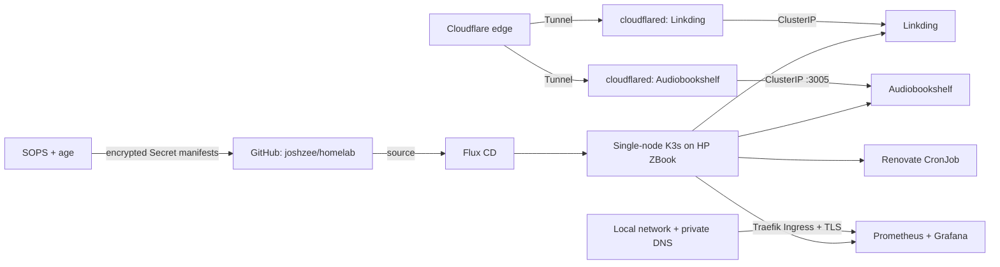

# Homelab

GitOps configuration and documentation for the Kubernetes homelab running on my repurposed HP ZBook.

This repository is the desired state of a single-node K3s cluster. I use it to practise the operational work around Kubernetes: application delivery, storage, security, networking, monitoring, upgrades and recovery.

Flux watches the repository and reconciles changes into the cluster. Application manifests are organised with Kustomize, third-party software is managed through Flux HelmRelease resources, and sensitive values are encrypted with SOPS and age before they reach Git.

## Architecture



Linkding and Audiobookshelf are published through separate outbound Cloudflare Tunnels. Neither application needs a public Kubernetes Service, an inbound router port or Traefik in its public request path. Grafana has a different boundary: it stays on the local network behind Traefik and a locally trusted certificate.

Renovate runs as an hourly CronJob and proposes dependency updates through pull requests. Flux deploys only the versions that have been reviewed and merged into the repository.

## What is running

| Component | Purpose | Access |
|---|---|---|
| K3s | Lightweight Kubernetes distribution | Single local node |
| Flux CD | Reconciles the cluster from Git | In-cluster controllers |
| Linkding | Self-hosted bookmark manager | Public HTTPS through Cloudflare Tunnel |
| Audiobookshelf | Self-hosted audiobook and podcast server | Public HTTPS through Cloudflare Tunnel |
| Prometheus | Collects cluster and node metrics | Internal cluster service |
| Grafana | Displays Prometheus metrics and dashboards | HTTPS from the local network only |
| Traefik | Routes local Ingress traffic | Supplied by K3s |
| SOPS and age | Encrypt Kubernetes Secret manifests | Decrypted by Flux during reconciliation |
| Renovate | Proposes dependency and image updates | Hourly Kubernetes CronJob |

## GitOps workflow

```text
Change a manifest
      ↓
Review and commit it
      ↓
Push to GitHub
      ↓
Flux retrieves the new revision
      ↓
Kustomize and Helm reconcile the cluster
      ↓
Verify controllers, workloads and application behaviour
```

Git contains the intended state. I still use `kubectl` and the Flux CLI to observe resources, investigate failures and request reconciliation, but routine deployment changes begin in Git rather than with an imperative apply.

## Repository structure

```text
.
├── apps/
│   ├── base/
│   │   ├── audiobookshelf/
│   │   └── linkding/
│   └── staging/
│       ├── audiobookshelf/
│       └── linkding/
├── clusters/
│   └── staging/                  # Flux entry points for the cluster
├── infrastructure/
│   └── controllers/
│       ├── base/
│       │   ├── renovate/
│       │   └── storage/          # local-path-retain StorageClass
│       └── staging/
├── monitoring/
│   ├── configs/
│   │   └── staging/              # SOPS-encrypted Grafana Secrets
│   └── controllers/
│       ├── base/                 # HelmRepository and HelmRelease
│       └── staging/
└── renovate.json
```

The top-level areas have separate jobs:

- `apps` contains user-facing workloads: Linkding and Audiobookshelf.
- `infrastructure` contains cluster support resources, currently Renovate and the retained local-path StorageClass.
- `monitoring/controllers` owns the resources that install and operate `kube-prometheus-stack`.
- `monitoring/configs` owns the staging-specific Grafana administrator and TLS Secrets.
- `clusters/staging` connects those paths to Flux Kustomizations.

The controllers/configs split gives monitoring configuration its own Flux inventory, status and reconciliation. It is an ownership boundary, not a security boundary; both Kustomizations are still operated by the same Flux controllers.

## Secrets

Secret manifests are encrypted with SOPS before being committed. The repository contains the public age recipient and ciphertext. The private age identity stays outside Git and is bootstrapped into the cluster as `Secret/flux-system/sops-age`.

```text
Plain value entered locally
      ↓
Kubernetes Secret manifest generated locally
      ↓
SOPS encrypts data/stringData fields
      ↓
Encrypted manifest committed to Git
      ↓
Flux decrypts it during reconciliation
      ↓
Application receives a normal Kubernetes Secret
```

This workflow currently protects:

- Linkding's application credentials;
- the Linkding and Audiobookshelf Cloudflare tunnel credentials;
- Grafana's administrator credentials and TLS private key;
- Renovate's GitHub token.

Each locally managed Cloudflare Tunnel has its own UUID-named JSON credential. During Secret generation that file is imported under the key `credentials.json`, then mounted inside its own `cloudflared` Pods. The same Secret name can safely exist in both application namespaces because Kubernetes names are namespace-scoped.

Audiobookshelf's login is separate from its tunnel credential. The application account lives in its persistent `/config` state; the tunnel credential only authorises the connector to Cloudflare.

The age private identity needs a secure backup outside the cluster. Without it, the encrypted manifests cannot be recovered after complete cluster loss.

## Storage

K3s dynamically provisions local volumes through Rancher's Local Path Provisioner. These volumes survive Pod replacement on the ZBook, but they cannot move transparently to another node.

Audiobookshelf uses four `ReadWriteOnce` claims:

| Mount | Size | StorageClass |
|---|---:|---|
| `/config` | 1Gi | `local-path-retain` |
| `/metadata` | 1Gi | `local-path-retain` |
| `/audiobooks` | 5Gi | `local-path-retain` |
| `/podcasts` | 5Gi | `local-path-retain` |

Its Deployment uses the `Recreate` strategy so two Audiobookshelf processes do not overlap while sharing SQLite and the same local claims.

The custom `local-path-retain` StorageClass uses `reclaimPolicy: Retain`. If a claim is deleted, the released PV and backing directory remain available for manual recovery. This does not prevent Flux from pruning a PVC, rebind the retained data automatically, copy it off the ZBook or replace a tested backup.

Linkding predates this StorageClass and remains a separate recovery concern.

## Security decisions

- Linkding runs as the image's existing `www-data` user with UID/GID 33.
- Audiobookshelf runs as the image's `node` user with UID/GID 1000.
- Both application containers require a non-root identity, use the runtime's default seccomp profile, disable privilege escalation and drop all Linux capabilities.
- Existing Audiobookshelf files were created before the non-root rollout. A temporary init container migrated the four mounted trees to ownership `1000:1000`; it is no longer part of the committed Deployment.
- Linkding's optional background tasks remain disabled because their Supervisor-based startup expects root and the feature is unnecessary here.
- Public applications use outbound Cloudflare Tunnels rather than router port forwarding.
- Grafana remains LAN-only and terminates locally trusted TLS at Traefik.
- Renovate proposes version changes for review; it does not merge or deploy them by itself.

These controls reduce the blast radius of an application compromise. They do not make a single-node homelab equivalent to a production platform.

## Monitoring flow

```text
node-exporter ───────┐
kube-state-metrics ─┼──> Prometheus ──PromQL──> Grafana ──> Dashboard
cluster targets ────┘
```

Prometheus scrapes node, cluster and Kubernetes object metrics. Grafana uses Prometheus as its data source and turns those queries into dashboards. The stack is installed from the Prometheus community Helm repository and managed by Flux's Helm Controller.

## Recovery lessons

Moving two Flux entry-point files outside the active Kustomize graph once caused Flux to prune the child Kustomizations and their namespaces. Restoring the correct Git paths rebuilt the declared resources, but it could not restore Linkding's deleted local-path data.

That incident established two rules:

1. A file existing in Git does not mean it belongs to the rendered resource graph.
2. Persistent storage is not a backup.

The monitoring reorganisation added another lesson. Moving live Secrets between two pruning-enabled Flux Kustomizations required a deliberate ownership handover: pause pruning on the old owner, reconcile the new owner first, verify unchanged Kubernetes UIDs, then restore pruning.

Audiobookshelf supplied a storage-level version of the same idea. Changing a process from root to UID 1000 did not rewrite the ownership of files already stored on its PVCs. The security rollout therefore included a one-time data migration.

## Current progress

- [x] Install Ubuntu Server and K3s on the ZBook
- [x] Bootstrap Flux against the `homelab` repository
- [x] Deploy and harden Linkding through Kustomize and Flux
- [x] Expose Linkding through a SOPS-backed Cloudflare Tunnel
- [x] Deploy `kube-prometheus-stack` through a Flux HelmRelease
- [x] Route Grafana through Traefik with locally trusted HTTPS
- [x] Split monitoring controllers and configs without recreating live Secrets
- [x] Run Renovate as an hourly Kubernetes CronJob
- [x] Review and reconcile Renovate dependency-update pull requests
- [x] Deploy Audiobookshelf on port 3005 through a ConfigMap and ClusterIP Service
- [x] Add four retained Audiobookshelf volumes
- [x] Run Audiobookshelf as its non-root `node` user
- [x] Publish Audiobookshelf through a SOPS-backed Cloudflare Tunnel
- [ ] Implement and test K3s and application-data restores
- [ ] Automate internal certificate renewal

## Known limitations

- The cluster has one node and is not highly available.
- K3s local-path volumes remain tied to that node.
- Retained PV recovery is manual, and a complete backup and restore has not been demonstrated.
- Grafana's self-signed 90-day certificate still has a manual renewal and client-trust process.
- Two `cloudflared` replicas protect against a connector-process failure, but both share the same physical node.
- Renovate can propose overlapping Flux bundle and individual-controller PRs; its matching rules still need refinement.
- Public applications currently rely on their own authentication. Cloudflare Access has not been added.

## Documentation

I write about the implementation decisions, failures and recovery work on [joshcodes.me](https://joshcodes.me/blog).

Recent posts:

- [The Database Remembered Root](https://joshcodes.me/blog/the-database-remembered-root)
- [GitOps, Please Don't Prune That Yet](https://joshcodes.me/blog/gitops-please-dont-prune-that-yet)
- [Updates, Pending Review](https://joshcodes.me/blog/updates-pending-review)
- [Grafana Gets a Front Door](https://joshcodes.me/blog/grafana-gets-a-front-door)
- [Prometheus, Pruning, and Recovery](https://joshcodes.me/blog/prometheus-pruning-and-recovery)

> This repository documents my own environment and is not intended to be applied unchanged to another cluster. Addresses, credentials, private keys and recovery material are intentionally excluded.
